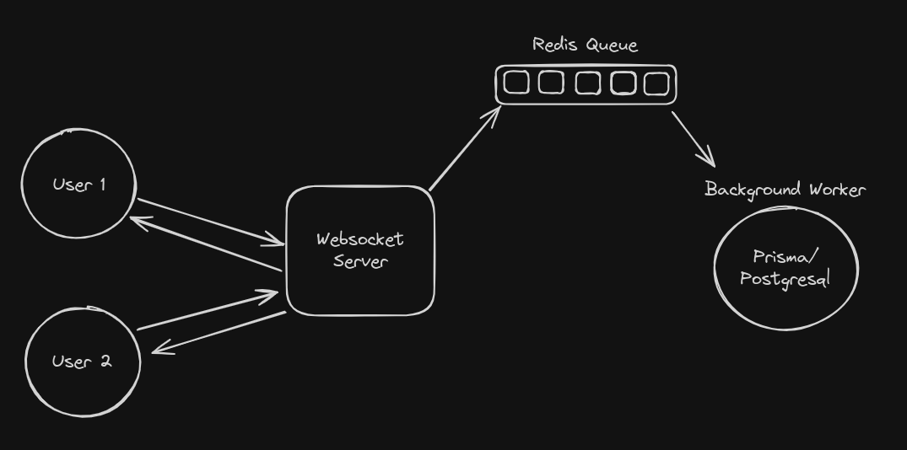

# JOURNALINK - INTERACTIVE BOOKMARKS MANAGER

## Backend Process:

## Description:

Journalink is a light and performant web application that allows you to journal your thoughts in a way that feels like text-messaging your thoughts in a way and further sort into folders and bookmarks in an intuitive drag and drop fashion. Websocket connection allows each thought to be shared to all your devices instantaniously. This web app is for those people that have thoughts/ideas and need to store permanently/temporarily.

## Motivation:

This web app needs to exist for people like myself that have a space cut off from social media where thoughts/ideas/urls can be otted down in a chat like component while having the option to further sort them into folder for better thought management. this idea takes inspiration from "whatsapping to yourself" and Microsoft edge's drop feature. I need my thoughts to appear instantaneously on all connected devices regardless of the OS. I also need it to be light and performant.

### Tech Used:

- `Nextjs`
- `Reactjs`
- `Typescript`
- `Aceternitiy/Shadcn/framerMotion`
- `tailwindcss`
- `PrismaDB`
- `Redis`
- `Turbo Repo`
- `Websocket`

